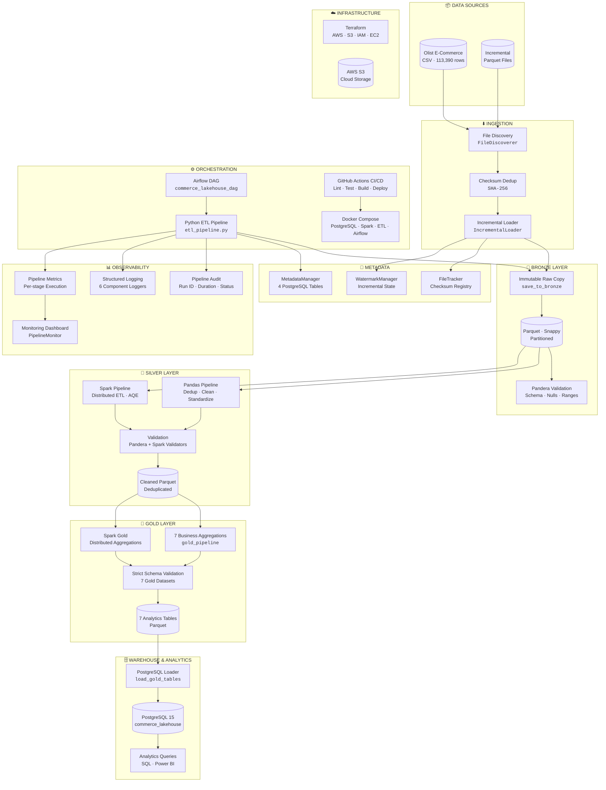
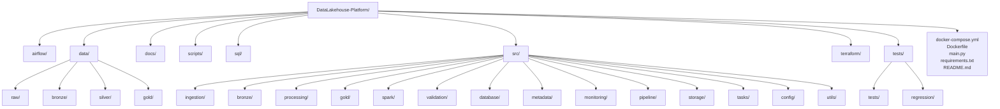
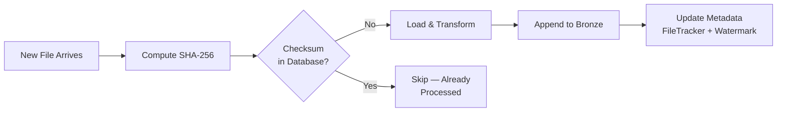
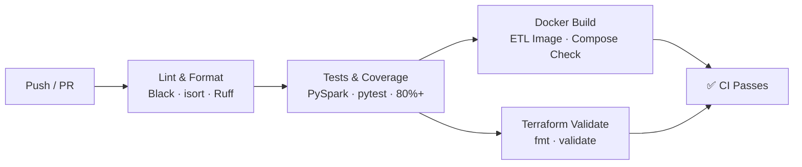
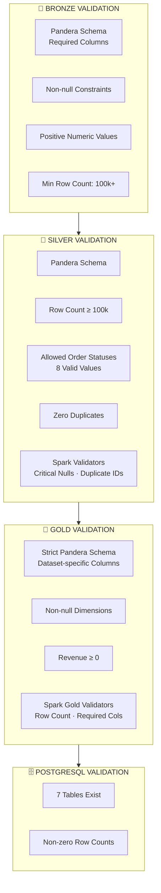
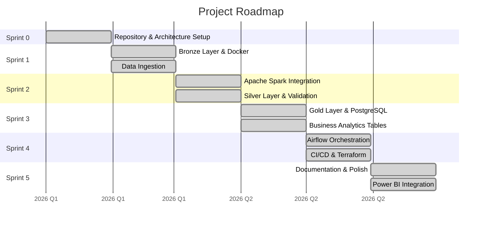

<div align="center">

# 🏗️ Unified Commerce Lakehouse

### Production-Grade Medallion Data Lakehouse — Apache Spark · Docker · PostgreSQL · Airflow

[](https://github.com/ojeshwigautam/DataLakehouse-Platform/actions/workflows/ci.yml)
[](https://python.org)
[](https://spark.apache.org)
[](https://postgresql.org)
[](https://docker.com)
[](https://airflow.apache.org)
[](https://github.com/features/actions)
[](https://pandera.readthedocs.io)
[](https://terraform.io)
[](https://aws.amazon.com/s3)
[](https://github.com/ojeshwigautam/DataLakehouse-Platform/actions)
[](https://github.com/psf/black)
[](LICENSE)
[](#)

---

### 🎯 Built by [Ojeshwi Gautam](https://github.com/ojeshwigautam)
### 📍 LPU × Futurense Industry Internship 2026 — Data Platform & Pipeline Engineering

</div>

---

## 📋 Table of Contents

- [Project Overview](#-project-overview)
- [Problem Statement](#-problem-statement)
- [Solution Architecture](#-solution-architecture)
- [Key Features](#-key-features)
- [Medallion Architecture](#-medallion-architecture)
- [ETL Workflow](#-etl-workflow)
- [Tech Stack](#-tech-stack)
- [Repository Structure](#-repository-structure)
- [Getting Started](#-getting-started)
- [Running with Docker](#-running-with-docker)
- [Running with Airflow](#-running-with-airflow)
- [Running the ETL Pipeline](#-running-the-etl-pipeline)
- [Running Incremental ETL](#-running-incremental-etl)
- [Running Tests](#-running-tests)
- [Running CI Locally](#-running-ci-locally)
- [Monitoring](#-monitoring)
- [Validation Framework](#-validation-framework)
- [Metadata Management](#-metadata-management)
- [Performance Benchmarks](#-performance-benchmarks)
- [Project Roadmap](#-project-roadmap)
- [Contributing](#-contributing)
- [License](#-license)
- [Acknowledgements](#-acknowledgements)

---

## 📖 Project Overview

The **Unified Commerce Lakehouse** is a production-grade Data Engineering platform that implements the **Medallion Architecture** (Bronze → Silver → Gold) to process multi-channel retail transaction data through a fully automated, validated, and orchestrated pipeline.

| Attribute | Detail |
|-----------|--------|
| **Dataset** | Brazilian Olist E-Commerce (Kaggle) |
| **Records** | 113,390+ rows · 38 columns |
| **Architecture** | Medallion (Bronze / Silver / Gold) |
| **Processing** | Apache Spark (PySpark) + Pandas |
| **Storage** | Apache Parquet (Snappy compression) |
| **Warehouse** | PostgreSQL 15 |
| **Orchestration** | Apache Airflow 2.11 + Python ETL |
| **Containerization** | Docker Compose |
| **CI/CD** | GitHub Actions (4 parallel jobs) |
| **Infrastructure as Code** | Terraform (AWS) |
| **Status** | 🟢 Production Ready |

---

## 🎯 Problem Statement

Multi-channel retail businesses generate transactional data across websites, mobile apps, stores, and marketplaces — each in different formats with inconsistent schemas and varying data quality. Organizations struggle with:

- **No single source of truth** across fragmented data sources
- **Duplicate records, null values, and schema mismatches** in raw data
- **No historical traceability** when transformations overwrite source data
- **Manual pipelines** with no failure recovery or idempotency guarantees
- **Inability to answer business questions**: daily revenue, top products, regional performance, seller rankings, delivery KPIs

### Solution

This platform solves these challenges by implementing a **Medallion Data Lakehouse** that:

1. Preserves raw data immutably (Bronze)
2. Cleans and standardizes via distributed processing (Silver)
3. Creates business-ready analytics tables (Gold)
4. Validates at every layer to ensure data quality
5. Automates the entire workflow with Airflow orchestration
6. Tracks everything via metadata and audit logging

---

## 🏛️ Solution Architecture



---

## ✨ Key Features

| Feature | Description |
|---------|-------------|
| **Medallion Architecture** | Bronze / Silver / Gold separation of concerns |
| **Dual Processing** | Pandas (local) + Apache Spark (distributed) |
| **Incremental Ingestion** | SHA-256 checksum dedup, watermark tracking, idempotent |
| **Data Validation** | Pandera schemas at every layer + Spark validators |
| **Pipeline Audit** | Every run logged with run_id, duration, row counts, status |
| **Structured Logging** | Per-component log files (pipeline, bronze, silver, gold, postgres) |
| **Airflow Orchestration** | DAG with branch detection, 10 stages, daily schedule |
| **PostgreSQL Warehouse** | 7 indexed analytics tables |
| **Containerized** | Docker Compose for ETL, Spark, PostgreSQL, Airflow |
| **AWS Ready** | Terraform IaC for S3, IAM, EC2 |
| **CI/CD Automation** | GitHub Actions with lint, test, Docker build, Terraform validate |
| **80%+ Test Coverage** | Unit, integration, and regression tests |
| **Parquet Storage** | Snappy compression, columnar format |
| **Power BI Integration** | Dashboard-ready data in PostgreSQL |

---

## 🏗️ Medallion Architecture

### 🥉 Bronze — Immutable Raw Zone

Stores data **exactly as received** — no transformations, no modifications.

- **Input:** Raw CSV (113,390 rows) + incremental Parquet batches
- **Storage:** Parquet with Snappy compression (`data/bronze/historical/`)
- **Validation:** Pandera schema — required columns, non-null, positive values
- **Purpose:** Source of truth for reprocessing, audit trail, compliance

### 🥈 Silver — Cleaned & Standardized Zone

Applies data quality transformations using **both Pandas and Apache Spark**.

- **Deduplication:** By `order_unique_id` or full row
- **Standardization:** City → lowercase, State → uppercase, timestamps → datetime
- **Cleaning:** String trimming, negative value filtering
- **Validation:** Pandera + Spark validators (required columns, allowed values, no duplicates)
- **Storage:** `data/silver/silver_orders.parquet`

### 🥇 Gold — Business Analytics Zone

Aggregates clean Silver data into **7 business-ready analytics tables**.

| Table | Business Question | Key Metrics |
|-------|-------------------|-------------|
| `daily_sales` | How much revenue did we make each day? | total_orders, total_revenue, avg_order_value |
| `monthly_sales` | What are the month-over-month trends? | MoM growth, revenue_per_customer |
| `top_products` | Which products drive the most revenue? | revenue_rank, units_sold, freight_impact |
| `top_states` | Which states contribute the most? | revenue_share, unique_customers |
| `payment_summary` | How do customers prefer to pay? | transaction_share, avg_installments |
| `seller_performance` | Which sellers perform best? | performance_tier, avg_revenue |
| `delivery_summary` | How fast do we deliver? | avg_delivery_days, late_rate |

---

## 🔄 ETL Workflow

```mermaid
flowchart LR
    RAW[Raw CSV Files] --> DISCOVER[File Discovery<br/><code>FileDiscoverer</code>]
    DISCOVER --> CHECKSUM[Checksum<br/><code>SHA-256</code>]
    CHECKSUM --> META{Already<br/>Processed?}
    META -->|No| BRONZE[Bronze Layer<br/>Immutable Parquet]
    META -->|Yes| SKIP[⏭️ Skip]
    BRONZE --> B_VALID[Bronze Validation<br/>Pandera Schema]
    B_VALID --> SILVER[Silver Layer<br/>Pandas / Spark]
    SILVER --> S_VALID[Silver Validation<br/>Pandera + Spark]
    S_VALID --> GOLD[Gold Layer<br/>7 Business Tables]
    GOLD --> G_VALID[Gold Validation<br/>Strict Schemas]
    G_VALID --> PG[PostgreSQL<br/>Warehouse]
    PG --> PG_VALID[PG Validation<br/>Table Existence]
    PG_VALID --> ANALYTICS[📊 Analytics<br/>SQL · Power BI]

    style BRONZE fill:#cd7f32,color:#fff
    style SILVER fill:#c0c0c0,color:#000
    style GOLD fill:#ffd700,color:#000
```



### Pipeline Stages (Airflow DAG)

| Stage | Task | Module | Duration |
|-------|------|--------|----------|
| 1 | Discover Incremental Files | `file_discovery.FileDiscoverer` | ~0.1s |
| 2 | Incremental Loader | `incremental_loader.IncrementalLoader` | ~0.5s |
| 3 | Bronze ETL | `tasks.bronze_task` | ~2.0s |
| 4 | Bronze Validation | `tasks.bronze_validation_task` | ~0.3s |
| 5 | Silver ETL | `tasks.silver_task` | ~2.0s |
| 6 | Silver Validation | `tasks.silver_validation_task` | ~0.3s |
| 7 | Gold ETL | `tasks.gold_task` | ~1.5s |
| 8 | Gold Validation | `tasks.gold_validation_task` | ~0.2s |
| 9 | PostgreSQL Load | `tasks.postgres_task` | ~2.0s |
| 10 | PostgreSQL Validation | `tasks.postgres_validation_task` | ~0.3s |
| — | Metadata Update | `MetadataManager` | ~0.2s |

---

## 🛠️ Tech Stack

| Category | Technology | Version | Purpose |
|----------|-----------|---------|---------|
| **Language** | Python | 3.11+ | Core ETL, orchestration, validation |
| **Language** | SQL | — | Analytics queries |
| **Distributed Processing** | Apache Spark (PySpark) | 4.0.0 | Silver/Gold distributed ETL |
| **Data Processing** | Pandas | 2.2+ | Local ETL pipeline |
| **Columnar Storage** | Apache Parquet | — | Efficient compressed storage |
| **Warehouse** | PostgreSQL | 15 | Gold layer + metadata |
| **Validation** | Pandera | 0.20+ | Schema and data quality |
| **Orchestration** | Apache Airflow | 2.11 | DAG scheduling and execution |
| **Containerization** | Docker Compose | Latest | Service orchestration |
| **CI/CD** | GitHub Actions | — | Automated testing and build |
| **Infrastructure as Code** | Terraform | 1.7+ | AWS resource provisioning |
| **Cloud Storage** | AWS S3 | — | Cloud-ready storage layer |
| **Object-Relational Mapping** | SQLAlchemy | 2.0+ | PostgreSQL connection |
| **Data Visualization** | Power BI | — | Business dashboards |
| **Code Quality** | Black / isort / Ruff | Latest | Formatting, imports, linting |
| **Testing** | pytest | Latest | Unit, integration, regression |
| **Environment** | python-dotenv | 1.0+ | Configuration management |

---

## 📁 Repository Structure



### Key Directories

| Directory | Purpose |
|-----------|---------|
| `src/ingestion/` | File discovery, checksum, incremental loading |
| `src/bronze/` | Bronze layer creation |
| `src/processing/` | Silver layer (Pandas) — dedup, clean, standardize |
| `src/gold/` | Gold layer — 7 business aggregations |
| `src/spark/` | Spark session, transforms, validators, reconciliation |
| `src/validation/` | Pandera schemas for Bronze, Silver, Gold |
| `src/database/` | PostgreSQL connection, table loading, validation |
| `src/metadata/` | Pipeline runs, file tracking, watermarks |
| `src/monitoring/` | Logging, metrics, execution timer |
| `src/pipeline/` | ETL orchestration |
| `src/storage/` | FileHandler abstraction (CSV/Parquet) |
| `src/tasks/` | Airflow task wrappers |
| `terraform/` | AWS IaC — S3, IAM, EC2, Security Groups |
| `tests/` | Unit, integration, and regression tests |
| `airflow/dags/` | Airflow DAG definitions |
| `sql/` | PostgreSQL analytics queries |

---

## 🚀 Getting Started

### Prerequisites

| Dependency | Version | Installation |
|-----------|---------|--------------|
| Python | 3.11+ | [python.org](https://python.org) |
| Java | 17+ | [adoptium.net](https://adoptium.net) |
| Docker Desktop | Latest | [docker.com](https://docker.com) |
| Git | Latest | [git-scm.com](https://git-scm.com) |

### Clone and Set Up

```bash
# Clone the repository
git clone https://github.com/ojeshwigautam/DataLakehouse-Platform.git
cd DataLakehouse-Platform

# Create virtual environment
python -m venv venv

# Activate it
# macOS/Linux: source venv/bin/activate
# Windows:     venv\Scripts\activate

# Install dependencies
pip install -r requirements.txt
pip install -r requirements-dev.txt

# Install pre-commit hooks
pre-commit install

# Configure environment
cp .env.example .env
# Edit .env with your credentials (defaults work for Docker)
```

### Set Java for Spark

```bash
# macOS/Linux
export JAVA_HOME=/path/to/jdk-17
export PATH=$JAVA_HOME/bin:$PATH

# Windows (System Environment Variables)
# Set JAVA_HOME = C:\Program Files\Java\jdk-17
# Add %JAVA_HOME%\bin to PATH

# Verify
java -version  # Must show 17.x.x
```

---

## 🐳 Running with Docker

### Start Core Services

```bash
# Build and start all services
docker compose up -d

# Verify services are running
docker compose ps

# View logs
docker compose logs -f
```

**Services started:**

| Service | Container Name | Port | Purpose |
|---------|---------------|------|---------|
| PostgreSQL | `commerce_lakehouse_postgres` | **5433:5432** | Warehouse + metadata |
| ETL | `commerce_lakehouse_etl` | — | Runs `python main.py` |
| Spark | `commerce_spark` | — | Spark processing (kept alive) |

> **Note:** PostgreSQL is exposed on port **5433** to avoid conflicts with local PostgreSQL installations.

### Run ETL Pipeline in Docker

```bash
# The ETL container runs main.py automatically on start
docker compose up etl

# Or run explicitly
docker compose run etl python main.py
```

### Run Spark in Docker

```bash
# Spark Silver pipeline
docker compose exec spark python /workspace/src/spark/silver_pipeline.py

# Spark Gold pipeline
docker compose exec spark python /workspace/src/spark/gold_pipeline.py
```

### Connect to PostgreSQL

```bash
docker compose exec postgres psql -U postgres -d commerce_lakehouse

# Or from host machine
psql -h localhost -p 5433 -U postgres -d commerce_lakehouse
```

---

## 🌬️ Running with Airflow

### Start Airflow Services

```bash
docker compose -f docker-compose.airflow.yml up -d
```

This starts 5 services:
- `postgres` — Lakehouse database (port 5433)
- `airflow-postgres` — Airflow metadata database
- `airflow-init` — Runs DB migration + creates admin user
- `airflow-webserver` — Web UI on **port 8081**
- `airflow-scheduler` — DAG execution

### Access Airflow UI

1. Open [http://localhost:8081](http://localhost:8081)
2. Login: `admin` / `admin123`
3. Find the `commerce_lakehouse_etl` DAG
4. Click **"Trigger DAG"** to run manually

### Stop Airflow

```bash
docker compose -f docker-compose.airflow.yml down

# Full reset (removes volumes)
docker compose -f docker-compose.airflow.yml down -v
```

---

## ⚡ Running the ETL Pipeline

### Full Pipeline

```bash
python main.py
```

Expected output:

```
======================================================================
  UNIFIED COMMERCE LAKEHOUSE — ETL PIPELINE
  Engine: Pandas + Spark | Storage: Parquet | Format: Snappy
======================================================================
  Started : 2026-07-18 10:00:00
======================================================================
STEP 2/9 : Bronze Layer              ✓  113,390 rows → Parquet
STEP 3/9 : Bronze Validation         ✓  Pandera Passed
STEP 4/9 : Silver Layer              ✓  113,201 records
STEP 5/9 : Silver Validation         ✓  Pandera Passed
STEP 6/9 : Gold Layer                ✓  7 tables created
STEP 7/9 : Gold Validation           ✓  All Passed
STEP 8/9 : PostgreSQL                ✓  7 tables loaded
STEP 9/9 : PostgreSQL Validation     ✓  All tables verified
Incremental Data Ingestion          ✓  0 batches
======================================================================
  PIPELINE SUMMARY
======================================================================
Raw Dataset        : olist_ecommerce_dataset.csv
Bronze Dataset     : bronze_orders.parquet
Silver Dataset     : silver_orders.parquet
Gold Datasets Generated : 7
PostgreSQL Tables Loaded  : 7
Execution Time     : 0:00:11.24
Pipeline Status    : SUCCESS
======================================================================
```

### Run Individual Stages

```bash
# Bronze only
python -m src.tasks.bronze_task

# Silver only
python -m src.tasks.silver_task

# Gold only
python -m src.tasks.gold_task

# PostgreSQL load only
python -m src.tasks.postgres_task
```

---

## 📥 Running Incremental ETL

The incremental processing pipeline ensures **idempotent** data ingestion — running the same batch twice produces identical results.



### Process Incremental Files

```python
from src.ingestion.incremental_loader import IncrementalLoader

loader = IncrementalLoader()
result = loader.run()

print(f"Files discovered: {result.total_files_discovered}")
print(f"New files processed: {result.new_files_count}")
print(f"Rows loaded: {result.rows_loaded}")
print(f"Status: {result.status}")
```

### Key Guarantees

| Feature | Implementation |
|---------|---------------|
| **Duplicate detection** | SHA-256 checksums stored in `metadata.processed_files` |
| **Idempotency** | Same file + content always skipped |
| **Watermark tracking** | Last processed file/timestamp stored in `metadata.watermarks` |
| **Bulk loading** | Merges with existing Bronze incremental Parquet |

---

## 🧪 Running Tests

### Full Test Suite

```bash
pytest tests/ -v
```

### With Coverage Report

```bash
pytest tests/ --cov=src --cov-report=html
# Open htmlcov/index.html in browser
```

### Test Categories

```bash
# All tests
pytest tests/ -v

# Unit tests only
pytest tests/ -v -m "not regression"

# Regression tests
pytest tests/regression/ -v

# Specific test file
pytest tests/test_bronze_validation.py -v
pytest tests/test_silver_validation.py -v
pytest tests/test_gold_validation.py -v
pytest tests/test_spark_transforms.py -v
pytest tests/test_incremental_loader.py -v

# Pipeline execution
pytest tests/test_pipeline_execution.py -v
```

### Spark Tests

```bash
pytest tests/test_spark_transforms.py -v
pytest tests/test_spark_validators.py -v
pytest tests/test_spark_gold_transforms.py -v
pytest tests/test_spark_reconciliation.py -v
```

### Coverage Configuration (`.coveragerc`)

- **Minimum coverage:** 80%
- **Source:** `src/`
- **Excludes:** `__init__.py`, migrations, tests, scripts, notebooks

---

## 🔧 Running CI Locally

Run the same checks that the GitHub Actions pipeline executes:

```bash
# 1. Formatting check (Black)
black --check .

# 2. Import order (isort)
isort --check-only --profile=black --line-length=88 .

# 3. Linting (Ruff)
ruff check .

# 4. Tests with coverage
pytest tests/ \
  --cov=src \
  --cov-report=term-missing \
  --cov-config=.coveragerc \
  -v

# 5. Docker build verification
docker compose build
docker compose config --quiet && echo "✅ Valid"
```

### CI Pipeline (GitHub Actions)



The CI pipeline runs on every push to `main`/`develop` and on pull requests.

---

## 📊 Monitoring

### Structured Logging

The platform writes per-component logs to `logs/`:

| Logger | File | Component |
|--------|------|-----------|
| `pipeline` | `logs/pipeline.log` | Main orchestration |
| `bronze` | `logs/bronze.log` | Bronze layer operations |
| `silver` | `logs/silver.log` | Silver layer operations |
| `gold` | `logs/gold.log` | Gold layer operations |
| `postgres` | `logs/postgres.log` | PostgreSQL operations |
| `airflow` | `logs/airflow.log` | Airflow DAG operations |

### Monitoring Dashboard

```bash
python -c "
from src.monitoring.pipeline_monitor import PipelineMonitor
PipelineMonitor.print_dashboard()
"
```

Output:
```
======================================================================
  PIPELINE MONITORING DASHBOARD
======================================================================
SUMMARY
  Total Runs               : 15
  Successful Runs          : 14
  Failed Runs              : 1
  Success Rate             : 93.33%
  Avg Duration             : 11.24s
  Total Incremental Batches: 3

LATEST RUN
  Run ID      : a1b2c3d4-...
  Pipeline    : Unified Commerce Lakehouse ETL
  Status      : SUCCESS
  Started     : 2026-07-18 10:00:00
  Completed   : 2026-07-18 10:00:11
  Duration    : 11.24s
```

### Pipeline Audit

Every execution is recorded in the `pipeline_audit` table:

```sql
SELECT run_id, status, execution_time_seconds, incremental_batches
FROM pipeline_audit
ORDER BY start_time DESC
LIMIT 5;
```

---

## ✅ Validation Framework

### Multi-Layer Validation



### Validation Reports

Results are saved as JSON to `reports/data_quality/`:

```json
{
  "layer": "bronze",
  "status": "PASSED",
  "message": "Bronze validation passed.",
  "timestamp": "2026-07-18T10:00:05"
}
```

---

## 📝 Metadata Management

The metadata system uses PostgreSQL with a dedicated `metadata` schema:

| Table | Purpose | Key Columns |
|-------|---------|-------------|
| `metadata.pipeline_runs` | Track every pipeline execution | `run_id`, `status`, `duration_seconds`, `rows_processed` |
| `metadata.processed_files` | Checksum-based duplicate prevention | `file_name`, `checksum` (SHA-256), `status` |
| `metadata.watermarks` | Track last processed position | `pipeline_name`, `last_processed_file`, `last_processed_timestamp` |
| `metadata.pipeline_metrics` | Per-stage execution metrics | `stage`, `duration_seconds`, `rows_processed`, `status` |

---

## 📈 Performance Benchmarks

| Metric | CSV | Parquet | Improvement |
|--------|-----|---------|-------------|
| **File Size** | 53.58 MB | 20.45 MB | **61.86% reduction** |
| **Read Speed** | 1.7207 sec | 0.2076 sec | **88.03% faster** |
| **Memory Usage** | 75.89 MB | 75.03 MB | **1.15% reduction** |

**Full Pipeline Runtime:** ~11.24 seconds (Baseline v1.0)

---

## 🗺️ Project Roadmap



### Future Enhancements

- [ ] Migrate to **AWS Glue** for fully managed Spark execution
- [ ] Add **Apache Iceberg** for ACID transactions on S3
- [ ] Implement real-time ingestion with **Apache Kafka**
- [ ] Add **dbt** for transformation lineage and documentation
- [ ] Deploy **Grafana** dashboards for pipeline monitoring
- [ ] Add **Great Expectations** for enhanced data quality
- [ ] Implement **data contracts** with schema registry
- [ ] Add **Apache Hudi** for incremental processing on S3

---

## 🤝 Contributing

We welcome contributions! Please see our [Contributing Guide](CONTRIBUTING.md) for details.

### Quick Start for Contributors

```bash
# Fork → clone → branch → commit → PR

git checkout -b feat/your-feature
git commit -m "feat(silver): add schema evolution handling"
git push origin feat/your-feature
```

**Guidelines:**
- Follow [Conventional Commits](https://www.conventionalcommits.org/)
- All PRs must pass CI before merge
- Add tests for new functionality
- Maintain 80%+ test coverage

---

## 📄 License

This project is licensed under the **MIT License** — see the [LICENSE](LICENSE) file for details.

---

## 🙏 Acknowledgements

- **Dataset:** [Brazilian E-Commerce Public Dataset by Olist](https://www.kaggle.com/datasets/olistbr/brazilian-ecommerce) on Kaggle
- **Institution:** LPU × Futurense Industry Internship 2026 — Data Platform & Pipeline Engineering
- **Technologies:** Apache Spark, Apache Airflow, PostgreSQL, Docker, Terraform

---

<div align="center">

### Built with ❤️ by [Ojeshwi Gautam](https://github.com/ojeshwigautam)

[](https://www.linkedin.com/in/ojeshwi-gautam)
[](https://github.com/ojeshwigautam)
[](mailto:ojeshwi.gautam@example.com)

> ⭐ Star this repository if you find it useful for understanding production-grade Data Engineering patterns!

</div>

