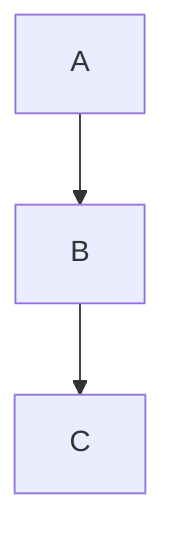
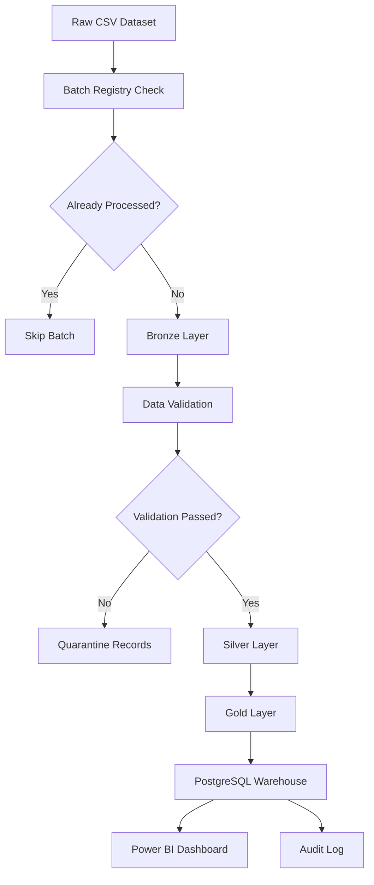
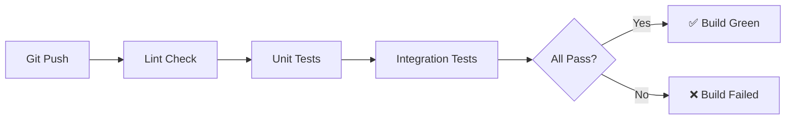

# 🏗️ Unified Commerce Lakehouse

> An end-to-end Data Engineering platform implementing Medallion Architecture
> (Bronze → Silver → Gold) with Apache Spark, Docker, PostgreSQL, and
> production-ready ETL pipelines on the Brazilian Olist E-Commerce Dataset.

[](https://github.com/ojeshwigautam/DataLakehouse-Platform/actions/workflows/ci.yml)


---





## Table of Contents

- [Project Overview](#project-overview)
- [Business Problem](#business-problem)
- [Architecture Overview](#architecture-overview)
- [Medallion Architecture](#medallion-architecture)
- [Pipeline Flow](#pipeline-flow)
- [Features](#features)
- [Project Structure](#project-structure)
- [Technology Stack](#technology-stack)
- [Installation](#installation)
- [Running with Docker](#running-with-docker)
- [Running Locally](#running-locally)
- [Running Tests](#running-tests)
- [GitHub Actions](#github-actions)
- [Gold Layer](#gold-layer)
- [Incremental Processing](#incremental-processing)
- [Data Validation](#data-validation)
- [Logging](#logging)
- [Screenshots](#screenshots)
- [Future Enhancements](#future-enhancements)
- [Contributing](#contributing)
- [License](#license)
- [Author](#author)

---

## Project Overview

The **Unified Commerce Lakehouse** is a production-style Data Engineering
platform that processes 113,390+ rows of multi-channel retail transaction
data through a fully automated, orchestrated, and validated pipeline.

| Attribute | Detail |
|---|---|
| Dataset | Brazilian Olist E-Commerce |
| Records | 113,390+ rows · 38 columns |
| Architecture | Medallion (Bronze / Silver / Gold) |
| Processing | Apache Spark (PySpark) |
| Storage | Apache Parquet |
| Warehouse | PostgreSQL |
| Pipeline | Python ETL Orchestration |
| Status | Production Ready |

---

## Business Problem

Multi-channel retail businesses generate transactional data across
websites, mobile apps, stores, and marketplaces — each in different
formats with inconsistent schemas and varying data quality.

Core challenges this platform solves:

- No single source of truth across fragmented data sources
- Duplicate records, null values, and schema mismatches in raw data
- No historical traceability when transformations overwrite source data
- Manual pipelines with no failure recovery or idempotency guarantees
- Inability to answer business questions: daily revenue, top products,
  regional performance, seller rankings, delivery KPIs

---

## Architecture Overview

```
┌──────────────────────────────────────────────────────┐
│                   DATA SOURCES                       │
│          Brazilian Olist E-Commerce CSV              │
│               113,390+ Records                       │
└─────────────────────┬────────────────────────────────┘
                      │
                      ▼
┌──────────────────────────────────────────────────────┐
│               INGESTION LAYER                        │
│     Incremental Batch Detection · Batch Registry     │
│            Idempotency Enforcement                   │
└─────────────────────┬────────────────────────────────┘
                      │
                      ▼
┌──────────────────────────────────────────────────────┐
│                BRONZE LAYER                          │
│      Immutable Raw Copy · Parquet · AWS S3           │
│             Partitioned by Date                      │
└─────────────────────┬────────────────────────────────┘
                      │
              Great Expectations
               Data Validation
                      │
                      ▼
┌──────────────────────────────────────────────────────┐
│                SILVER LAYER                          │
│         Apache Spark Distributed ETL                 │
│   Deduplication · Null Handling · Type Casting       │
│          Parquet · AWS S3 Ready                      │
└─────────────────────┬────────────────────────────────┘
                      │
                      ▼
┌──────────────────────────────────────────────────────┐
│                 GOLD LAYER                           │
│       Business Aggregations · 7 Analytics Tables     │
│           PostgreSQL Warehouse                       │
└──────────┬───────────────────────────┬───────────────┘
           │                           │
           ▼                           ▼
    Power BI Dashboards          Audit Logging
                                  Monitoring


━━━━━━━━━━━━━━━━━━━━━━━━━━━━━━━━━━━━━━━━━━━━━━━━━━━━━
PIPELINE Python  ETL Orchestration
CONTAINERS       Docker Compose
CI/CD            GitHub Actions
━━━━━━━━━━━━━━━━━━━━━━━━━━━━━━━━━━━━━━━━━━━━━━━━━━━━━
```

---

## Medallion Architecture

### 🥉 Bronze — Raw Immutable Zone
Stores data exactly as received. No transformations applied.
Partitioned by ingestion date on AWS S3 in Parquet format.
Serves as the audit trail and reprocessing source for all
downstream layers.

### 🥈 Silver — Cleaned and Standardized Zone
Apache Spark performs distributed ETL: deduplication, null
handling, type casting, and string standardization. Great
Expectations validates every dataset before it progresses.
Rejected records are quarantined with failure reasons logged —
never silently dropped.

### 🥇 Gold — Business Analytics Zone
Business aggregations and KPI calculations on clean Silver data.
Seven analytics-ready tables served through PostgreSQL warehouse
and consumed by Power BI dashboards.

---

## Pipeline Flow



---

## Features

| Feature | Description |
|---|---|
| Medallion Architecture | Bronze / Silver / Gold separation of concerns |
| Distributed ETL | Apache Spark for scalable data processing |
| Incremental Ingestion | Batch Registry with idempotency guarantees |
| Data Validation | Great Expectations with quarantine for rejected records |
| Audit Logging | Every pipeline run logged with row counts and duration |
| Parquet Storage | Columnar format with Snappy compression |
| AWS S3 Ready | Cloud storage abstraction layer |
| Docker Compose | Single command platform startup |
| GitHub Actions CI/CD | Automated testing on every push |
| pytest Suite | Unit, integration, and reconciliation tests |
| PostgreSQL Warehouse | Indexed analytics tables |
| Production Logging | Structured logs to file and console |

---

## Project Structure

```
unified-commerce-lakehouse/
│
├── architecture/               # System diagrams
├── dashboards/                 # Power BI files
│
├── data/
│   ├── raw/                    # Source CSV (git-ignored)
│   ├── bronze/                 # Bronze Parquet (git-ignored)
│   ├── silver/                 # Silver Parquet (git-ignored)
│   └── gold/                   # Gold Parquet (git-ignored)
│
├── docker/                     # Dockerfile configurations
├── docs/                       # ADRs and documentation
├── logs/                       # Pipeline logs (git-ignored)
├── sql/                        # DDL and queries
│
├── src/
│   ├── bronze/                 # Bronze ingestion logic
│   ├── config/                 # Centralized settings
│   ├── database/               # PostgreSQL loader
│   ├── gold/                   # Gold aggregation logic
│   ├── monitoring/             # Metrics and audit
│   ├── pipeline/               # ETL orchestration
│   ├── processing/             # Spark Silver processor
│   ├── spark/                  # SparkSession factory
│   ├── validation/             # Great Expectations suites
│   └── utils/                  # Logger and helpers
│
├── terraform/                  # AWS IaC
├── tests/
│   ├── unit/                   # Unit tests
│   └── integration/            # Integration tests
│
├── .env.example
├── .github/workflows/ci.yml
├── docker-compose.yml
├── main.py
├── requirements.txt
└── README.md
```

---

## Technology Stack

| Category | Technology |
|---|---|
| Language | Python 3.11, SQL |
| Processing | Apache Spark 3.5, PySpark, Pandas |
| Pipeline | Python ETL Orchestration |
| Storage | Apache Parquet, AWS S3 |
| Warehouse | PostgreSQL 15, SQLAlchemy |
| Data Quality | Great Expectations |
| Containers | Docker, Docker Compose |
| IaC | Terraform |
| CI/CD | GitHub Actions |
| Testing | pytest, Spark Unit Tests |
| Monitoring | Audit Logging, Pipeline Metrics |
| Visualization | Power BI |

---

## Installation

### Prerequisites

- Python 3.11+
- Docker Desktop
- AWS CLI configured
- Git

### Clone and Configure

```bash
git clone git clone https://github.com/ojeshwigautam/DataLakehouse-Platform.git
cd unified-commerce-lakehouse

python -m venv venv
source venv/bin/activate        # Windows: venv\Scripts\activate

pip install -r requirements.txt

cp .env.example .env
# Edit .env with your credentials
```

---

## Running with Docker

```bash
# Start all services
docker-compose up -d

# Verify
docker-compose ps


---

## Running Locally

```bash
# Run full pipeline
python main.py

# Run incremental batch
python -c "
from src.ingestion.incremental_ingester import IncrementalIngester
from src.config.settings import RAW_DATASET
ingester = IncrementalIngester()
ingester.run_incremental(RAW_DATASET, batch_number=1)
ingester.run_incremental(RAW_DATASET, batch_number=1)  # skipped
ingester.run_incremental(RAW_DATASET, batch_number=2)  # processed
"
```

Expected output:

```
======================================================================
  UNIFIED COMMERCE LAKEHOUSE — ETL PIPELINE v2.0
  Engine: Apache Spark | Storage: Parquet | Format: Snappy
======================================================================
Step 1/5: Loading raw dataset          ✓  113,390 rows
Step 2/5: Saving to Bronze             ✓  Parquet · S3
Step 3/5: Validation                   ✓  Passed
Step 4/5: Silver — Apache Spark        ✓  113,201 records
Step 5/5: Gold                         ✓  7 tables loaded
======================================================================
  PIPELINE COMPLETE ✓
======================================================================
```

---

## Running Tests

```bash
# Full test suite
pytest tests/ -v

# With coverage
pytest tests/ -v --cov=src --cov-report=html

# Unit tests only
pytest tests/unit/ -v

# Integration tests only
pytest tests/integration/ -v
```

---

## GitHub Actions

Every push to `main` or `develop` triggers:

```yaml
Jobs:

Install Dependencies

Execute PyTest Suite

Validate Spark Transformations

Verify ETL Pipeline
```



---

## Gold Layer

| Table | Business Question | Key Columns |
|---|---|---|
| `daily_sales` | Revenue by day | total_orders, total_revenue, avg_order_value |
| `monthly_sales` | MoM growth trends | mom_growth_pct, revenue_per_customer |
| `top_products` | Best performing products | revenue_rank, units_sold, freight_pct |
| `top_states` | Regional distribution | revenue_share_pct, unique_customers |
| `payment_summary` | Payment method breakdown | transaction_share_pct, avg_installments |
| `seller_performance` | Seller tier classification | performance_tier, avg_revenue_per_order |
| `delivery_summary` | Delivery time by region | avg_delivery_days, late_delivery_rate |

---

## Incremental Processing

The Batch Registry tracks every processed file with a unique key.
On each pipeline run:

1. Incoming batch is checked against the registry
2. Already-processed batches are skipped automatically
3. New batches are processed and registered
4. Registry stores: batch key, timestamp, records processed, status

This guarantees **idempotency** — running the pipeline twice on the
same input always produces identical output.

---

## Data Validation

The platform performs automated schema and data quality validation before promoting data to downstream layers.

Validation checks include:

- Required columns
- Null value detection
- Data type validation
- Positive numeric validation
- Date validation
- Duplicate detection
- Business rule validation

Records failing validation are quarantined with detailed failure reasons, ensuring reliable downstream analytics while preserving traceability.
---

## Logging

Every pipeline run produces:

- Console output with INFO level
- File log at `logs/YYYY-MM-DD.log` with DEBUG level
- Audit record: run timestamp, rows read, rows written, duration, status
- Structured format for downstream log aggregation tools

---

## Screenshots

| Screenshot | Path |
|---|---|
| Pipeline success log | `docs/screenshots/pipeline-success.png` |
| Power BI dashboard | `docs/screenshots/powerbi-dashboard.png` |
| GitHub Actions CI | `docs/screenshots/github-actions.png` |
| PostgreSQL tables | `docs/screenshots/postgres-tables.png` |

---

## Future Enhancements

- [ ] Migrate to AWS Glue for fully managed Spark execution
- [ ] Add Apache Iceberg for ACID transactions on S3
- [ ] Implement real-time ingestion with Apache Kafka
- [ ] Add natural language query layer with LangChain
- [ ] Add dbt lineage documentation

---

## Contributing

```bash
# Fork → branch → commit → PR

git checkout -b feat/your-feature
git commit -m "feat(silver): add schema evolution handling"
git push origin feat/your-feature
```

- Follow `conventional commits` format
- All PRs must pass CI before merge
- Add tests for new functionality

---

## License

MIT License — see [LICENSE](LICENSE) for details.

---

## Author

**Ojeshwi Gautam**
B.Tech CSE (AI & Data Engineering) · Lovely Professional University

[](https://www.linkedin.com/in/ojeshwi-gautam)
[](https://github.com/ojeshwigautam)

---

> ⭐ Star this repository if it helped you understand production Data Engineering patterns.
