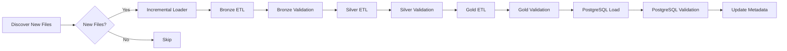
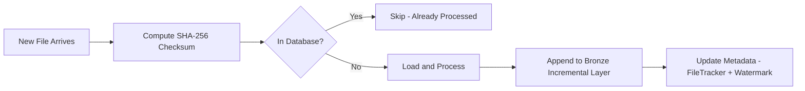
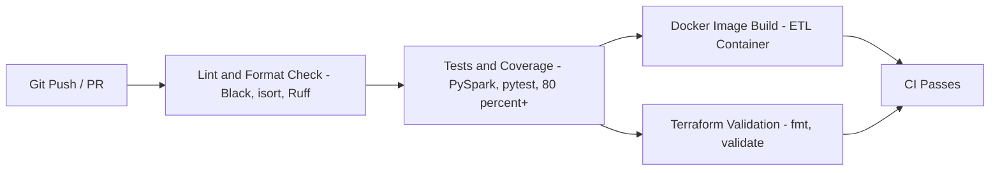

# System Architecture

## Overview

The **Unified Commerce Lakehouse** implements the **Medallion Architecture** — a modern data engineering design pattern that organizes data into sequential layers (Bronze → Silver → Gold) to progressively improve data quality, reliability, and business value.

The platform processes the Brazilian Olist E-Commerce dataset (113,390+ records) through a fully automated, validated, and orchestrated pipeline.

---

## Architecture Diagram

```mermaid
%%{init: {"flowchart": {"htmlLabels": false}} }%%
flowchart TB
    subgraph Sources["DATA SOURCES"]
        CSV[("Brazilian Olist - E-Commerce CSV - 113,390 rows - 38 columns")]
    end

    subgraph Ingestion["INGESTION LAYER"]
        FD[File Discovery - FileDiscoverer]
        CHK[Checksum - calculate_sha256]
        IL[Incremental Loader - IncrementalLoader]
        FT[File Tracker - FileTracker]
    end

    subgraph Bronze["BRONZE LAYER - Immutable Raw"]
        B_SAVE[save_to_bronze - src/bronze/save_to_bronze.py]
        B_VALID[Bronze Validation - Pandera Schema - src/validation/]
        B_PARQUET[("Parquet Format - Snappy Compression - Partitioned")]
    end

    subgraph Spark["SPARK PROCESSING"]
        SPARK_SESSION[SparkSession - local - AQE - 8 partitions]
        SILVER_SPARK[Silver Transforms - clean_orders()]
        SPARK_RECON[Reconciliation - Bronze vs Silver]
    end

    subgraph Silver["SILVER LAYER - Cleaned and Standardized"]
        SILVER_PANDAS[Silver Pipeline - Pandas - src/processing/]
        S_VALID[Silver Validation - Pandera + Spark Validators]
        S_PARQUET[("Parquet Format - Deduplicated - Standardized")]
    end

    subgraph Gold["GOLD LAYER - Business Analytics"]
        G_PANDAS[Gold Pipeline - Pandas - src/gold/]
        G_SPARK[Spark Gold - Distributed Aggregations - src/spark/]
        G_VALID[Gold Validation - Strict Schema - src/validation/]
        G_TABLES[("7 Business Tables - Parquet Format")]
    end

    subgraph Warehouse["WAREHOUSE AND ANALYTICS"]
        PG_LOAD[PostgreSQL Loader - load_gold_tables()]
        PG_VALID[PostgreSQL Validation - Table Existence + Row Counts]
        POSTGRES[("PostgreSQL 15 - commerce_lakehouse")]
        QUERIES[Analytics Queries - sql/analytics_queries.sql]
    end

    subgraph Orchestration["ORCHESTRATION"]
        PIPELINE[ETL Pipeline - src/pipeline/etl_pipeline.py]
        AIRFLOW[Airflow DAG - commerce_lakehouse_dag.py]
        DOCKER[Docker Compose - PostgreSQL, ETL, Spark, Airflow]
        CI[GitHub Actions CI/CD - Lint, Test, Build, IaC]
    end

    subgraph Metadata["METADATA AND MONITORING"]
        MM[MetadataManager - src/metadata/]
        METRICS[PipelineMetrics - src/monitoring/]
        AUDIT[Pipeline Audit - pipeline_audit]
        LOGS[Structured Logging - Per-component log files]
        WM[WatermarkManager - Incremental Tracking]
    end

    subgraph Infra["INFRASTRUCTURE"]
        TF[Terraform - AWS, S3, IAM, EC2]
        S3[("AWS S3 - Cloud Storage - Ready")]
    end

    %% Connections
    CSV --> FD
    FD --> CHK
    CHK --> IL
    IL --> FT
    FT --> B_SAVE

    B_SAVE --> B_PARQUET
    B_PARQUET --> B_VALID

    B_PARQUET --> SILVER_PANDAS
    B_PARQUET --> SPARK_SESSION
    SPARK_SESSION --> SILVER_SPARK
    SILVER_SPARK --> SPARK_RECON

    SILVER_PANDAS --> S_VALID
    SILVER_SPARK --> S_VALID
    S_VALID --> S_PARQUET

    S_PARQUET --> G_PANDAS
    S_PARQUET --> SPARK_SESSION
    SPARK_SESSION --> G_SPARK
    G_PANDAS --> G_VALID
    G_SPARK --> G_VALID
    G_VALID --> G_TABLES

    G_TABLES --> PG_LOAD
    PG_LOAD --> POSTGRES
    POSTGRES --> PG_VALID
    POSTGRES --> QUERIES

    PIPELINE --> B_SAVE
    PIPELINE --> SILVER_PANDAS
    PIPELINE --> G_PANDAS
    PIPELINE --> PG_LOAD
    AIRFLOW --> PIPELINE

    PIPELINE --> MM
    PIPELINE --> METRICS
    PIPELINE --> AUDIT
    PIPELINE --> LOGS
    IL --> WM

    TF --> S3
    DOCKER --> POSTGRES
    CI --> DOCKER
```

---

## Data Flow

The data flows through the system in a sequential, layered manner:

### 1. Raw Files (Historical Dataset)

The Olist E-Commerce CSV file (`data/raw/historical/olist_ecommerce_dataset.csv`) serves as the primary data source. The dataset contains 113,390 rows and 38 columns covering orders, customers, products, sellers, payments, and reviews.

### 2. File Discovery (`src/ingestion/file_discovery.py`)

The `FileDiscoverer` scans the `data/raw/incremental/` directory for new files. It supports CSV, Parquet, and JSON formats, ignores hidden/temporary files, and sorts by modification time.

### 3. Checksum Verification (`src/ingestion/checksum.py`)

Before processing, SHA-256 checksums are computed for each file and checked against the metadata database to prevent duplicate processing — even if filenames change.

### 4. Incremental Loader (`src/ingestion/incremental_loader.py`)

The `IncrementalLoader` orchestrates the incremental ingestion flow:
- Discovers new files in the incremental folder
- Compares checksums against the database
- Loads only unprocessed files
- Appends new data to the Bronze incremental layer
- Updates metadata (processed files + watermarks)

### 5. Bronze Layer (`src/bronze/save_to_bronze.py`)

Data is saved in Parquet format with Snappy compression to `data/bronze/historical/bronze_orders.parquet`. This layer stores data exactly as received — no transformations applied.

### 6. Bronze Validation (`src/validation/bronze_validation.py`)

Validates the Bronze layer using Pandera:
- Required columns: `order_id`, `order_item_id`, `customer_id`, `product_id`, `seller_id`, `price`, `freight_value`, `payment_value`, `order_purchase_timestamp`, `order_status`
- Non-null constraints on all required columns
- Numeric columns must be >= 0
- Minimum row count threshold (100,000+)
- Validation reports saved as JSON

### 7. Silver Layer (Dual Processing)

**Pandas Pipeline** (`src/processing/silver_pipeline.py`):
- Loads historical + incremental Bronze data
- Deduplicates by `order_unique_id`
- Trims whitespace on all string columns
- Standardizes city (lowercase) and state (uppercase)
- Converts timestamp columns
- Filters negative numeric values
- Outputs to `data/silver/silver_orders.parquet`

**Spark Pipeline** (`src/spark/silver_pipeline.py`):
- Same transformations via PySpark `clean_orders()`
- Supports distributed execution for larger datasets
- Generates reconciliation report (Bronze vs Silver comparison)

### 8. Silver Validation (`src/validation/silver_validation.py`)

Validates the Silver layer with:
- Schema validation (same as Bronze + additional columns)
- Row count threshold (100,000+)
- Order status allowed values validation
- Duplicate detection (zero duplicates required)

### 9. Gold Layer (`src/gold/gold_pipeline.py`)

Creates 7 business-ready analytics datasets from Silver data:

| Dataset | Business Purpose |
|---------|-----------------|
| `daily_sales.parquet` | Revenue trends by day |
| `monthly_sales.parquet` | Month-over-month growth |
| `top_products.parquet` | Top 10 products by revenue |
| `top_states.parquet` | Customer state distribution |
| `payment_summary.parquet` | Payment method analysis |
| `seller_performance.parquet` | Seller ranking (top 20) |
| `delivery_summary.parquet` | Delivery time statistics |

### 10. Gold Validation (`src/validation/gold_validation.py`)

Strict schema validation for each of the 7 Gold datasets using Pandera with `strict=True` and column-level null/range checks.

### 11. PostgreSQL Load (`src/database/load_gold_tables.py`)

All 7 Gold datasets are loaded into PostgreSQL tables using `SQLAlchemy` + `to_sql` with replace mode.

### 12. PostgreSQL Validation (`src/database/validate_tables.py`)

Validates that all 7 expected tables exist in PostgreSQL and have non-zero row counts.

---

## Airflow Orchestration

The Airflow DAG (`airflow/dags/commerce_lakehouse_dag.py`) orchestrates the full pipeline:



- **Schedule:** `@daily`
- **Branching:** Dynamically chooses incremental processing based on file discovery
- **Task Isolation:** Each pipeline stage runs as an independent `BashOperator`
- **Dependencies:** Sequential execution with clear stage boundaries

---

## Metadata Management

The metadata system uses PostgreSQL with a dedicated `metadata` schema containing 4 tables:

### `metadata.pipeline_runs`
Tracks every pipeline execution:
- `run_id` (UUID primary key)
- `start_time`, `end_time`
- `status` (RUNNING / SUCCESS / FAILED)
- `duration_seconds`, `files_processed`, `rows_processed`
- `error_message` (for failed runs)

### `metadata.processed_files`
Checksum-based duplicate detection:
- `file_name`, `checksum` (SHA‑256)
- Unique constraint on `(file_name, checksum)`
- `processed_timestamp`, `run_id`, `status`

### `metadata.watermarks`
Tracks last processed position for incremental processing:
- `pipeline_name` (unique)
- `last_processed_file`, `last_processed_timestamp`

### `metadata.pipeline_metrics`
Per-stage execution metrics:
- `run_id`, `stage`, `duration_seconds`
- `rows_processed`, `status`, `timestamp`

---

## Validation Framework

The platform implements a multi-layer validation strategy:

| Layer | Tool | Checks |
|-------|------|--------|
| Bronze | Pandera | Required columns, non-null, positive values, row count |
| Silver | Pandera | Schema, row count, allowed values, duplicates |
| Gold | Pandera | Strict schema, column types, ranges |
| Spark Silver | Custom Validator | Row count, required columns, duplicate IDs, null detection |
| Spark Gold | Custom Validator | Row count, required columns, revenue >= 0, dimension nulls |
| PostgreSQL | Manual | Table existence, row counts |

Validation reports are saved as JSON to `reports/data_quality/`.

---

## Incremental Processing

The incremental processing architecture ensures idempotent and efficient data ingestion:



**Key Components:**
- `IncrementalLoader` — Orchestrates the incremental flow
- `FileDiscoverer` — Scans for new files in `data/raw/incremental/`
- `FileTracker` — Checksum-based duplicate detection
- `WatermarkManager` — Tracks last processed file/timestamp
- `ChecksumUtils` — SHA-256 computation (supports MD5 for legacy)

---

## Monitoring

### Structured Logging (`src/monitoring/logger.py`)

Per-component loggers write to individual files:
- `logs/pipeline.log` — Main pipeline orchestration
- `logs/bronze.log` — Bronze layer operations
- `logs/silver.log` — Silver layer operations
- `logs/gold.log` — Gold layer operations
- `logs/postgres.log` — PostgreSQL operations
- `logs/airflow.log` — Airflow DAG operations

### Pipeline Metrics (`src/monitoring/pipeline_metrics.py`)

Stores per-stage execution metrics in PostgreSQL:
- Stage name, duration, rows processed, status

### Pipeline Monitor (`src/monitoring/pipeline_monitor.py`)

Aggregates monitoring data:
- Total runs, success rate, average duration
- Latest run details with error messages
- Per-stage metrics breakdown

### Execution Timer (`src/monitoring/execution_timer.py`)

Reusable timer utility used across all pipeline stages.

---

## CI/CD Pipeline

The GitHub Actions CI pipeline (`ci.yml`) runs on every push to `main`/`develop` and on PRs:



**Jobs:**
1. **Lint & Format Check** — Black formatting, isort import order, Ruff static analysis
2. **Tests & Coverage** — PySpark verification, pytest with coverage, HTML report
3. **Docker Image Build** — Builds ETL image, validates docker-compose.yml
4. **Terraform Validation** — `terraform fmt -check` and `terraform validate`

---

## Docker Architecture

The platform runs three main services:

| Service | Image | Purpose |
|---------|-------|---------|
| `postgres` | `postgres:18` | Metadata storage + Gold layer warehouse |
| `etl` | Custom `Dockerfile` | Runs the full ETL pipeline |
| `spark` | `apache/spark:4.2.0` | Spark processing (kept alive for ad-hoc queries) |

**Airflow services** (separate compose file):
| Service | Purpose |
|---------|---------|
| `airflow-postgres` | Airflow metadata database |
| `airflow-init` | Database migration + user creation |
| `airflow-webserver` | Airflow UI on port 8081 |
| `airflow-scheduler` | DAG scheduling and execution |

---

## File Structure

```
DataLakehouse-Platform/
│
├── airflow/dags/             # Airflow DAG definitions
├── data/
│   ├── raw/                  # Source CSV and incremental files
│   ├── bronze/               # Immutable raw Parquet
│   ├── silver/               # Cleaned & standardized Parquet
│   └── gold/                 # Business analytics Parquet
│
├── docs/                     # Documentation
├── logs/                     # Pipeline logs (per-component)
├── reports/                  # Validation reports
├── sql/                      # Analytics queries
├── scripts/                  # Utility scripts
├── src/
│   ├── bronze/               # Bronze layer logic
│   ├── config/               # Centralized settings
│   ├── database/             # PostgreSQL connection & loaders
│   ├── gold/                 # Gold layer logic
│   ├── ingestion/            # File discovery, checksum, incremental
│   ├── metadata/             # Pipeline runs, file tracking, watermarks
│   ├── monitoring/           # Logging, metrics, execution timer
│   ├── pipeline/             # ETL orchestration
│   ├── processing/           # Silver layer (Pandas), data quality
│   ├── spark/                # Spark session, transforms, validators
│   ├── storage/              # FileHandler abstraction (CSV/Parquet)
│   ├── tasks/                # Airflow task modules
│   ├── utils/                # Decorators, file utilities
│   └── validation/           # Pandera validation schemas
│
├── terraform/                # AWS IaC
├── tests/                    # Unit, integration, regression tests
│
├── docker-compose.yml        # Main services
├── docker-compose.airflow.yml # Airflow services
├── Dockerfile                # ETL container
├── main.py                   # Pipeline entry point
└── requirements.txt          # Python dependencies
```

