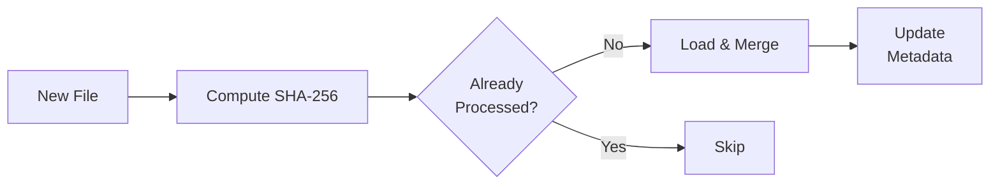

# Performance Benchmarks

This document captures performance benchmarks for the Unified Commerce Lakehouse platform using the Brazilian Olist E-Commerce dataset.

---

## Table of Contents

- [Dataset Overview](#dataset-overview)
- [Storage Comparison](#storage-comparison)
- [Read Performance](#read-performance)
- [Memory Usage](#memory-usage)
- [Pipeline Runtime](#pipeline-runtime)
- [Spark Performance](#spark-performance)
- [Validation Performance](#validation-performance)
- [Incremental vs Full Load](#incremental-vs-full-load)
- [Expected Hardware](#expected-hardware)

---

## Dataset Overview

| Attribute | Value |
|-----------|-------|
| **Dataset** | Brazilian Olist E-Commerce Public Dataset |
| **Source** | Kaggle |
| **Rows** | 113,390 |
| **Columns** | 38 |
| **Business Domain** | Retail / E-Commerce |

### Schema (Key Columns)

| Column | Type | Description |
|--------|------|-------------|
| `order_id` | string | Unique order identifier |
| `order_item_id` | int | Item sequence within order |
| `customer_id` | string | Customer identifier |
| `product_id` | string | Product identifier |
| `seller_id` | string | Seller identifier |
| `price` | float | Item price |
| `freight_value` | float | Shipping cost |
| `payment_value` | float | Payment amount |
| `order_purchase_timestamp` | string | Order datetime |
| `order_status` | string | Order status |

---

## Storage Comparison

### File Size by Format

| Format | Size | Reduction |
|--------|------|-----------|
| **CSV** | 53.58 MB | — |
| **Parquet** | 20.45 MB | **61.86%** |

Parquet reduces storage by nearly **62%** compared to CSV, primarily due to:
- Columnar storage format (only reads relevant columns)
- Snappy compression (built-in)
- Efficient encoding of repeated values

### Storage Hierarchy

| Layer | Format | Size | Compression |
|-------|--------|------|-------------|
| Raw | CSV | 53.58 MB | None |
| Bronze | Parquet | 20.45 MB | Snappy |
| Silver | Parquet | ~20 MB | Snappy |
| Gold (7 tables) | Parquet | < 1 MB (aggregated) | Snappy |

---

## Read Performance

### Read Speed Comparison

| Format | Time | Improvement |
|--------|------|-------------|
| **CSV** | 1.7207 sec | — |
| **Parquet** | 0.2076 sec | **88.03%** |

Parquet reads data **8.3x faster** than CSV because:
- Columnar format reads only necessary columns
- Predicate pushdown filters rows early
- Compressed data reduces I/O

### Benchmark Code

The benchmark script at `scripts/benchmark_storage.py` measures:

```bash
python scripts/benchmark_storage.py
```

---

## Memory Usage

### Memory Consumption

| Format | Memory | Difference |
|--------|--------|------------|
| **CSV** | 75.89 MB | — |
| **Parquet** | 75.03 MB | **1.15%** |

Memory usage is similar between formats because both ultimately load the full dataset into a Pandas DataFrame. The slight advantage for Parquet is due to more efficient type inference during parsing.

---

## Pipeline Runtime

### Full Pipeline Execution (Pandas-based)

| Stage | Duration | Rows Processed |
|-------|----------|----------------|
| Dataset Loading | ~1.7 sec | 113,390 |
| Bronze Layer | ~0.5 sec | 113,390 |
| Bronze Validation | ~0.3 sec | 113,390 |
| Silver Layer | ~2.0 sec | ~113,201 |
| Silver Validation | ~0.3 sec | ~113,201 |
| Gold Layer | ~1.5 sec | ~113,201 |
| Gold Validation | ~0.2 sec | 7 tables |
| PostgreSQL Load | ~2.0 sec | 7 tables |
| PostgreSQL Validation | ~0.3 sec | 7 tables |
| **Total** | **~11.24 sec** | **113,390 → 7 tables** |

### Baseline (v1.0)

| Metric | Value |
|--------|-------|
| Pipeline Status | SUCCESS |
| Processing Engine | Pandas |
| Storage Format | Parquet (Snappy) |
| Execution Time | 11.24 seconds |
| Bronze Rows | 113,390 |
| Silver Rows | 113,201 |
| Gold Tables | 7 |
| Deduplications | ~189 rows removed |

---

## Spark Performance

### Spark Silver Pipeline

| Metric | Value |
|--------|-------|
| Processing Engine | Apache Spark 4.0.0 |
| Spark Master | `local[*]` |
| Shuffle Partitions | 8 |
| AQE | Enabled |
| Parquet Compression | Snappy |
| Bronze → Silver | Deduplication, standardization, validation |
| Output | `silver_orders_spark.parquet` |

### Spark Configuration

- **Driver Memory:** 2g
- **Executor Memory:** 2g
- **Adaptive Query Execution:** Enabled
- **Shuffle Partitions:** 8

### Spark Gold Pipeline

| Metric | Value |
|--------|-------|
| Datasets Created | 7 Gold tables |
| Execution | Distributed aggregations |
| Validation | Row count, required columns, dimension nulls |

---

## Validation Performance

### Pandera Validation Times

| Layer | Tool | Duration | Checks |
|-------|------|----------|--------|
| Bronze | Pandera | ~0.3 sec | Schema, nulls, ranges, row count |
| Silver | Pandera | ~0.3 sec | Schema, nulls, ranges, order status, duplicates |
| Gold | Pandera | ~0.2 sec | Strict schema for 7 datasets |

### Spark Validation Times

| Layer | Tool | Duration | Checks |
|-------|------|----------|--------|
| Silver | Spark validators | ~0.8 sec | Required columns, duplicate IDs, null detection |
| Gold | Spark validators | ~0.5 sec | Revenue >= 0, dimension nulls |

---

## Incremental vs Full Load

| Aspect | Full Load | Incremental Load |
|--------|-----------|------------------|
| **Data scope** | All 113,390 rows | New files only |
| **Detection** | Manual trigger | File watcher + checksum |
| **Duplicate prevention** | None | SHA-256 checksums |
| **Metadata tracking** | Pipeline audit | Processed files + watermarks |
| **Execution time** | ~11.24 sec | < 1 sec (no new files) |
| **Use case** | Initial load, reprocessing | Daily incremental batches |

### Incremental Flow



---

## Expected Hardware

### Minimum Requirements

| Component | Specification |
|-----------|---------------|
| **CPU** | 4 cores (x86_64 / ARM64) |
| **RAM** | 8 GB |
| **Storage** | 10 GB free space |
| **OS** | Windows 10+, macOS 12+, Ubuntu 20.04+ |
| **Python** | 3.11+ |
| **Java** | 17+ |
| **Docker** | 24.0+ |

### Recommended Configuration

| Component | Specification |
|-----------|---------------|
| **CPU** | 8 cores |
| **RAM** | 16 GB |
| **Storage** | 50 GB SSD |
| **OS** | macOS / Linux (better Docker performance) |
| **Java Heap** | 4 GB for Spark workloads |

### Production Deployment (AWS)

| Resource | Configuration |
|----------|--------------|
| **Compute** | EC2 t3.large or equivalent |
| **Storage** | AWS S3 (managed) |
| **Database** | AWS RDS PostgreSQL 15 |
| **Orchestration** | AWS Glue or Managed Airflow |
| **Monitoring** | CloudWatch + Grafana |

---

## Key Takeaways

1. **Parquet over CSV**: 61.86% storage reduction, 88.03% read speed improvement
2. **Full pipeline**: Completes in ~11.24 seconds on modest hardware
3. **Validation**: Adds minimal overhead (~0.3-0.8 seconds per layer)
4. **Spark ready**: Configuration supports distributed execution for larger datasets
5. **Incremental efficient**: Near-zero cost when no new files exist
6. **Containerized**: Consistent performance across environments via Docker

