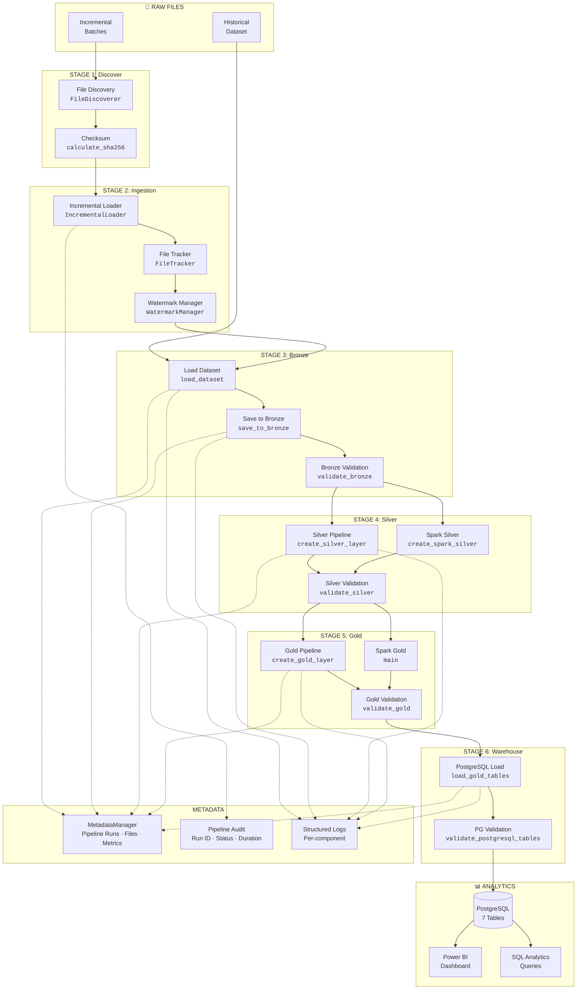

# ETL Pipeline Flow

This document describes the complete ETL workflow of the Unified Commerce Lakehouse, explaining each stage, the modules involved, and how data progresses through the system.

---

## Pipeline Overview



---

## Stage-by-Stage Walkthrough

### Stage 1: Raw Files

| Attribute | Details |
|-----------|---------|
| **Input** | Brazilian Olist E-Commerce dataset (CSV) |
| **Location** | `data/raw/historical/olist_ecommerce_dataset.csv` |
| **Records** | 113,390 rows × 38 columns |
| **Format** | CSV (53.58 MB) |
| **Incremental** | Parquet files in `data/raw/incremental/` |

The platform processes two types of raw data:
- **Historical**: The full Olist dataset loaded as a single batch
- **Incremental**: New Parquet files placed in the incremental directory for ongoing processing

---

### Stage 2: File Discovery & Ingestion

#### File Discovery

| Attribute | Details |
|-----------|---------|
| **Module** | `src/ingestion/file_discovery.py` |
| **Class** | `FileDiscoverer` |
| **Supported formats** | `.csv`, `.parquet`, `.json` |
| **Excludes** | Hidden files (`.` prefix), temp files (`~` suffix) |

The `FileDiscoverer` scans the incremental directory and returns sorted file paths for processing. It supports sorting by:
- Modification time (`mtime`)
- Filename (`name`)
- File size (`size`)

#### Checksum Computation

| Attribute | Details |
|-----------|---------|
| **Module** | `src/ingestion/checksum.py` |
| **Functions** | `calculate_sha256()`, `calculate_md5()`, `compare_checksum()` |
| **Algorithm** | SHA-256 (64 hex chars), MD5 (32 hex chars) |
| **Buffer** | 64 KB chunks for memory efficiency |

Checksums prevent duplicate processing even if filenames change — identical content will always produce the same hash.

#### Incremental Loader

| Attribute | Details |
|-----------|---------|
| **Module** | `src/ingestion/incremental_loader.py` |
| **Class** | `IncrementalLoader` |
| **Result** | `IncrementalResult` dataclass |

The loader orchestrates the full incremental flow:
1. **Discover** files in the incremental folder
2. **Filter** new files using `FileTracker.prevent_duplicate()` (checks filename + checksum)
3. **Load** new files into a DataFrame
4. **Merge** with existing Bronze incremental data
5. **Save** to Bronze layer
6. **Update** metadata (processed files + watermarks)

#### File Tracker

| Attribute | Details |
|-----------|---------|
| **Module** | `src/metadata/file_tracker.py` |
| **Class** | `FileTracker` |
| **Table** | `metadata.processed_files` |

Prevents duplicate processing by:
1. Computing SHA-256 checksum of the file
2. Checking if `(file_name, checksum)` already exists with status `SUCCESS`
3. If not found, recording the file as processed

#### Watermark Manager

| Attribute | Details |
|-----------|---------|
| **Module** | `src/metadata/watermark_manager.py` |
| **Class** | `WatermarkManager` |
| **Table** | `metadata.watermarks` |

Tracks the last processed file and timestamp for each pipeline, enabling batch-aware incremental processing.

---

### Stage 3: Bronze Layer

#### Load Dataset

| Attribute | Details |
|-----------|---------|
| **Module** | `src/ingestion/load_dataset.py` |
| **Function** | `load_dataset()` |
| **Input** | `data/raw/historical/olist_ecommerce_dataset.csv` |
| **Output** | `pandas.DataFrame` |

Loads the CSV dataset and removes any accidental index column (`Unnamed: 0`).

#### Save to Bronze

| Attribute | Details |
|-----------|---------|
| **Module** | `src/bronze/save_to_bronze.py` |
| **Function** | `save_to_bronze()` |
| **Output** | `data/bronze/historical/bronze_orders.parquet` |
| **Format** | Parquet with Snappy compression |

The Bronze layer stores data exactly as received — no transformations applied. This serves as the immutable source of truth and audit trail.

#### Bronze Validation

| Attribute | Details |
|-----------|---------|
| **Module** | `src/validation/bronze_validation.py` |
| **Function** | `validate_bronze()` |
| **Tool** | Pandera |
| **Report** | `reports/data_quality/bronze_validation.json` |

Validation checks:
- Dataset is not empty
- Row count >= 100,000
- Required columns exist with correct types
- Numeric columns (price, freight_value, payment_value) >= 0
- No null values in required columns

---

### Stage 4: Silver Layer

#### Pandas Silver Pipeline

| Attribute | Details |
|-----------|---------|
| **Module** | `src/processing/silver_pipeline.py` |
| **Function** | `create_silver_layer()` |
| **Input** | Bronze dataset (historical + incremental) |
| **Output** | `data/silver/silver_orders.parquet` |

The Pandas-based Silver pipeline performs:
1. **Load** historical + incremental Bronze data
2. **Deduplicate** by `order_unique_id` (fallback: full row dedup)
3. **Trim** whitespace on all string columns
4. **Standardize** city names to lowercase, state names to uppercase
5. **Convert** 6 timestamp columns to datetime
6. **Filter** negative numeric values (price, payment_value, freight_value)
7. **Save** to Parquet

#### Spark Silver Pipeline

| Attribute | Details |
|-----------|---------|
| **Module** | `src/spark/silver_pipeline.py` |
| **Function** | `create_spark_silver()` |
| **Transform** | `src/spark/transforms.py` — `clean_orders()` |
| **Validation** | `src/spark/validators.py` — `validate_silver_orders()` |
| **Output** | `data/silver/silver_orders_spark.parquet` |

Spark transformations mirror the Pandas pipeline:
- Deduplication via `dropDuplicates(["order_unique_id"])`
- String trimming on all string-typed columns
- City/state standardization (lower/upper)
- Timestamp conversion via `to_timestamp()`
- Negative value filtering via `.filter(col >= 0)`

A **reconciliation report** is generated comparing Bronze vs Silver:
- Row counts (input → output, rows removed)
- Schema differences (missing/extra columns)
- Validation status

#### Silver Validation

| Attribute | Details |
|-----------|---------|
| **Module** | `src/validation/silver_validation.py` |
| **Function** | `validate_silver()` |
| **Tool** | Pandera |
| **Report** | `reports/data_quality/silver_validation.json` |

Checks:
- Empty dataset detection
- Schema validation (same as Bronze)
- Row count >= 100,000
- Order status in allowed set: `approved`, `canceled`, `created`, `delivered`, `invoiced`, `processing`, `shipped`, `unavailable`
- Zero duplicate rows

---

### Stage 5: Gold Layer

#### Pandas Gold Pipeline

| Attribute | Details |
|-----------|---------|
| **Module** | `src/gold/gold_pipeline.py` |
| **Function** | `create_gold_layer()` |
| **Input** | `data/silver/silver_orders.parquet` |
| **Output** | 7 Parquet files in `data/gold/` |

Creates 7 business analytics tables:

| Dataset | Business Question | Key Columns |
|---------|-------------------|-------------|
| `daily_sales` | Revenue by day | order_date, total_orders, total_revenue, avg_order_value |
| `monthly_sales` | Month-over-month trends | order_month, total_orders, total_revenue, avg_order_value |
| `top_products` | Best performing products | product_category, total_orders, total_revenue, avg_price |
| `top_states` | Regional distribution | customer_state, total_orders, total_revenue |
| `payment_summary` | Payment method breakdown | payment_type, total_transactions, total_amount, avg_payment |
| `seller_performance` | Seller ranking | seller_id, total_orders, total_revenue, avg_order_value |
| `delivery_summary` | Delivery performance | avg_delivery_days, min_delivery_days, max_delivery_days |

#### Spark Gold Pipeline

| Attribute | Details |
|-----------|---------|
| **Module** | `src/spark/gold_pipeline.py` |
| **Function** | `main()` |
| **Transforms** | `src/spark/gold_transforms.py` |
| **Validation** | `src/spark/gold_validators.py` — `validate_gold_dataset()` |

Spark Gold pipeline produces the same 7 datasets using distributed aggregations:
- Daily/monthly sales aggregation with `countDistinct` and `sum`
- Seller performance with delivery day calculations
- Payment summary with average payment
- Delivery summary with date diff calculations
- Top products and states by revenue

#### Gold Validation

| Attribute | Details |
|-----------|---------|
| **Module** | `src/validation/gold_validation.py` |
| **Function** | `validate_gold()` |
| **Tool** | Pandera (strict schemas) |
| **Report** | `reports/data_quality/gold_validation.json` |

Validates all 7 Gold datasets with strict Pandera schemas, including:
- Data types, non-null constraints, positive values
- Dataset-specific required columns

---

### Stage 6: PostgreSQL Warehouse

#### Load Gold Tables

| Attribute | Details |
|-----------|---------|
| **Module** | `src/database/load_gold_tables.py` |
| **Function** | `load_gold_tables()` |
| **Method** | `df.to_sql()` with replace mode |
| **Engine** | SQLAlchemy with `postgresql+psycopg2` |

Maps 7 Parquet files to PostgreSQL tables:

| Parquet File | PostgreSQL Table |
|-------------|------------------|
| `daily_sales.parquet` | `daily_sales` |
| `monthly_sales.parquet` | `monthly_sales` |
| `top_products.parquet` | `top_products` |
| `top_states.parquet` | `top_states` |
| `payment_summary.parquet` | `payment_summary` |
| `seller_performance.parquet` | `seller_performance` |
| `delivery_summary.parquet` | `delivery_summary` |

#### PostgreSQL Validation

| Attribute | Details |
|-----------|---------|
| **Module** | `src/database/validate_tables.py` |
| **Function** | `validate_postgresql_tables()` |

Validates that:
- All 7 tables exist in PostgreSQL
- Each table contains rows (non-zero count)

---

### Stage 7: Analytics

The final stage makes data available for business intelligence:

| Tool | Purpose |
|------|---------|
| **PostgreSQL** | 7 analytics tables for querying |
| **SQL Queries** | Pre-written analytics in `sql/analytics_queries.sql` |
| **Power BI** | Dashboard visualization (files in `dashboards/`) |

Pre-built SQL queries include:
- Daily sales trends (last 20 days)
- Monthly sales with month-over-month comparison
- Top 10 products by revenue
- Top 10 customer states
- Payment method analysis
- Seller performance ranking
- Delivery performance metrics
- Table row counts across all tables

---

## Orchestration

### Python Pipeline (`main.py`)

```mermaid
flowchart TB
    START[main.py] --> RUN[<code>run_pipeline()</code>]
    RUN --> AUDIT_START[Start Pipeline Audit]
    AUDIT_START --> BRONZE[Step 1: Bronze Layer]
    BRONZE --> B_VAL[Step 2: Bronze Validation]
    B_VAL --> SILVER[Step 3: Silver Layer]
    SILVER --> S_VAL[Step 4: Silver Validation]
    S_VAL --> GOLD[Step 5: Gold Layer]
    GOLD --> G_VAL[Step 6: Gold Validation]
    G_VAL --> PG[Step 7: PostgreSQL Load]
    PG --> PG_VAL[Step 8: PostgreSQL Validation]
    PG_VAL --> INCR[Incremental Processing]
    INCR --> AUDIT_COMPLETE[Complete Pipeline Audit]
    AUDIT_COMPLETE --> FINISH[✅ SUCCESS]
```

### Airflow DAG (`commerce_lakehouse_dag.py`)

The Airflow DAG runs daily and includes:
- **Discover** → branch based on new file availability
- **Incremental Loader** → process new batches
- **Bronze ETL** → Bronze layer creation
- **Bronze Validation** → schema validation
- **Silver ETL** → Silver transformations (Pandas)
- **Silver Validation** → quality checks
- **Gold ETL** → business aggregation
- **Gold Validation** → strict schema checks
- **PostgreSQL Load** → warehouse loading
- **PostgreSQL Validation** → table verification
- **Metadata Update** → watermark progression

---

## Pipeline Audit

Every pipeline execution is recorded in the `pipeline_audit` table:

| Field | Description |
|-------|-------------|
| `run_id` | UUID generated at start |
| `pipeline_name` | "Unified Commerce Lakehouse ETL" |
| `start_time` | When the pipeline started |
| `end_time` | When the pipeline completed |
| `status` | RUNNING / SUCCESS / FAILED |
| `execution_time_seconds` | Total duration |
| `incremental_batches` | Number of incremental files processed |
| `error_message` | Error details (if failed) |

